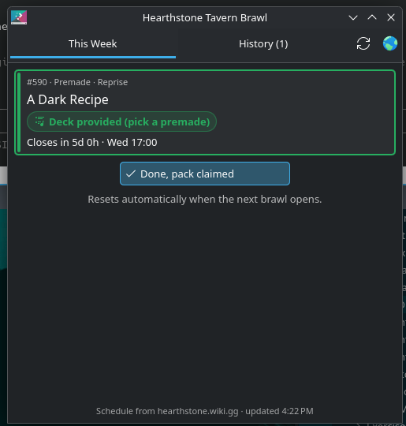

# Hearthstone Tavern Brawl — KDE Plasma widget

A Plasma 6 widget that answers one question: **have I done this week's Tavern Brawl?**
Tick it off once you've won the card pack, and it un-ticks itself when the next brawl opens.



## Features

- Current brawl name, number and type from the [Hearthstone Wiki](https://hearthstone.wiki.gg/wiki/Tavern_Brawl),
  with a countdown until it closes
- Deck indicator: build your own deck (Constructed, Brawliseum) or deck provided (Premade, Randomized),
  plus Co-op and Single-player brawls
- "Mark as done" toggle that resets by itself when a new brawl opens; a brawl that runs for more
  than one week stays done
- History tab: every brawl you've marked done, with a count of card packs earned
- Panel icon with a green check when done and an orange dot while the pack is unclaimed;
  middle-click to toggle done
- Notifications when a new brawl opens, and an optional reminder N hours before it closes if
  you haven't done it

## Install

From the KDE Store: *Add Widgets… → Get New Widgets… → Download New Plasma Widgets* and search for
**Hearthstone Tavern Brawl**.

Or from source:

```sh
git clone https://github.com/p145085/plasma-hearthstone-tavernbrawl.git
kpackagetool6 -t Plasma/Applet -i plasma-hearthstone-tavernbrawl/package
```

Upgrade with `kpackagetool6 -t Plasma/Applet -u plasma-hearthstone-tavernbrawl/package`.

## Build a .plasmoid

```sh
cd package && zip -r ../hearthstone-tavernbrawl.plasmoid . && cd ..
```

## Notes

Since patch 31.2 every region follows the Americas schedule: a brawl opens Wednesday at 9:00 AM
Pacific time and closes an hour before the next one opens. The widget follows US daylight saving
time, so in UTC that is 16:00 in summer and 17:00 in winter, and shows it in your local time.

The history and pack count only include brawls marked done in the widget. Blizzard's public
Hearthstone API has game data (cards, decks) but no account or reward history, so earlier
brawls can't be imported.

Not affiliated with Blizzard Entertainment or the Hearthstone Wiki.

## License

GPL-3.0-or-later
